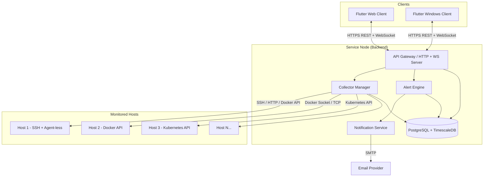

# IMPLEMENTATION_PLAN.md

## 1) Overview

**Vision:** Build a fast, visually rich, cross-platform monitoring and management platform for servers and homelabs that scales from a single Raspberry Pi to enterprise clusters. A lightweight "service node" deploys on any machine to collect metrics, aggregate logs, manage Docker/Kubernetes workloads, and expose a secure API. Flutter-based client apps connect from anywhere—initially Windows + Web, later expanding to all platforms—delivering a snappy, non-blocking UI that gracefully handles slow or unreachable endpoints with per-panel loading states and partial data rendering.

**Primary Users & Use Cases:**
- **Homelab Enthusiasts:** Monitor a handful of self-hosted servers, NAS devices, Raspberry Pis, and Docker stacks from a single dashboard; receive email alerts when disk fills or a container crashes.
- **Small/Medium IT Teams:** Centralize visibility across dev/staging/prod servers; quickly SSH into boxes; view Kubernetes pod health; set up on-call email notifications.
- **Enterprise (vNext):** Multi-tenant deployments with SSO, RBAC, audit logs, high-availability clustering, and integrations with existing observability stacks (Prometheus, Grafana, PagerDuty).

---

## 2) Assumptions

- The service node runs on Linux (primary), with Windows/macOS support as secondary; collectors will abstract OS differences.
- Users have basic familiarity with Docker; Docker Compose is the default deployment method for the service node.
- For v1, a single service-node instance is sufficient (no clustering/HA); HA is vNext.
- Time-series metrics retention of ~7 days raw, 90 days downsampled is acceptable for v1.
- Email (SMTP) is the only notification channel for v1; Slack/webhooks/PagerDuty are vNext.
- Users will provide their own SMTP credentials (e.g., Gmail app password); the app will never store or log plaintext secrets beyond encrypted config.
- SSH terminal in v1 is a deep-link to the user's local terminal emulator with connection string; full in-app terminal is vNext.
- Kubernetes support in v1 is read-only and limited (nodes, pods, deployments, services, logs); advanced RBAC/CRDs are vNext.
- Discovery is LAN-only (ARP + port scan on common ports); WAN/cloud discovery is vNext.
- No mobile clients in v1; architecture must not block them.

---

## 3) Non-Goals for v1

- **Mobile apps (iOS/Android):** Architecture supports them, but not shipped in v1.
- **macOS/Linux desktop clients:** Windows + Web only for v1.
- **Full in-app SSH terminal:** v1 offers deep-link/launch external terminal.
- **High-availability / clustering:** Single service-node instance only.
- **SSO / OIDC / LDAP:** Local user accounts only; SSO is vNext.
- **Multi-tenancy / org hierarchy:** Single-tenant deployment.
- **Advanced Kubernetes features:** Helm releases, CRDs, admission controllers, etc.
- **Non-email notifications:** Slack, webhooks, PagerDuty, SMS deferred to vNext.
- **Cloud provider integrations:** AWS/GCP/Azure VM discovery deferred.
- **Plugin marketplace / dynamic loading:** Collector plugin pattern is internal for v1.

---

## 4) Architecture

### 4.1 High-Level Diagram



### 4.2 Backend Stack Recommendation

| Option | Pros | Cons |
|--------|------|------|
| **Go (selected)** | Single binary, low memory, excellent concurrency, strong SSH/Docker/K8s libraries, easy cross-compile | Less rapid prototyping than Python/Node |
| Rust | Maximum performance, memory safety | Steeper learning curve, slower iteration |
| Node.js (TypeScript) | Fast iteration, large ecosystem | Higher memory, less efficient for long-running concurrent collectors |

**Decision:** **Go** for the service node backend. Reasons: low resource footprint ideal for Raspberry Pi deployments, first-class SSH (`golang.org/x/crypto/ssh`), Docker SDK, and Kubernetes client-go libraries, single-binary deployment simplifies Docker images.

### 4.3 Data Flow

- **Polling model (primary):** Collector Manager schedules periodic collection jobs per host/service (default: 15s for metrics, 60s for discovery). Results are written to TimescaleDB.
- **Push/streaming:** WebSocket connections push real-time updates (log tails, container events) to subscribed clients. Internal Go channels fan out events.
- **Event bus:** Lightweight in-process pub/sub (Go channels) for v1; replaceable with Redis Streams/NATS for HA in vNext.
- **Caching:** In-memory LRU cache for recent metrics (last 5 minutes) to serve dashboard requests without hitting DB.

### 4.4 Security Model

| Aspect | v1 Approach |
|--------|-------------|
| **Authentication** | Local users with bcrypt-hashed passwords; JWT access tokens (15 min) + refresh tokens (7 days) stored in HttpOnly cookies (web) or secure storage (Windows). |
| **Encryption** | TLS 1.3 enforced for API; optional self-signed cert generation on first run; recommend reverse proxy (Traefik/Caddy) for production. |
| **RBAC** | Single "admin" role for v1; vNext adds viewer/operator/admin roles. |
| **Secrets handling** | Credentials for monitored hosts stored AES-256-GCM encrypted in DB; encryption key derived from `SERVICE_NODE_SECRET` env var. SMTP passwords stored encrypted; never logged. |
| **Local vs remote access** | Binds to `127.0.0.1` by default; explicit config to bind `0.0.0.0` for LAN/VPN access. Firewall/VPN is user's responsibility. |

---

## 5) Repository & Project Structure

### 5.1 Monorepo Decision

**Monorepo** using a simple directory structure (no Bazel/Nx for v1). Rationale: shared API schema, atomic commits across backend + frontend, simpler CI.

### 5.2 Directory Layout

```
/
├── service-node/              # Go backend
│   ├── cmd/
│   │   └── serviced/          # Main entrypoint
│   ├── internal/
│   │   ├── api/               # HTTP/WS handlers, middleware
│   │   ├── auth/              # JWT, sessions, user mgmt
│   │   ├── collectors/        # Plugin pattern implementations
│   │   │   ├── system/        # CPU, mem, disk, temps, procs
│   │   │   ├── network/       # Interfaces, traffic, ports
│   │   │   ├── logs/          # Journald, file-based logs
│   │   │   ├── docker/        # Containers, images, compose
│   │   │   ├── kubernetes/    # Nodes, pods, deployments
│   │   │   └── discovery/     # LAN scan
│   │   ├── alerting/          # Rule engine, evaluator
│   │   ├── notify/            # Email sender, channel interface
│   │   ├── storage/           # DB models, repositories, migrations
│   │   ├── scheduler/         # Job scheduling, task queue
│   │   └── config/            # Env/file config loading
│   ├── migrations/            # SQL migration files
│   ├── go.mod
│   └── go.sum
│
├── app/                       # Flutter client
│   ├── lib/
│   │   ├── main.dart
│   │   ├── app/               # App shell, routing, themes
│   │   ├── features/          # Feature-first structure
│   │   │   ├── auth/
│   │   │   ├── dashboard/
│   │   │   ├── servers/
│   │   │   ├── logs/
│   │   │   ├── docker/
│   │   │   ├── kubernetes/
│   │   │   ├── alerts/
│   │   │   └── settings/
│   │   ├── core/              # Shared utilities, API client, models
│   │   └── widgets/           # Reusable UI components
│   ├── test/
│   ├── web/
│   ├── windows/
│   ├── pubspec.yaml
│   └── analysis_options.yaml
│
├── shared/                    # Shared API schema
│   ├── openapi.yaml           # OpenAPI 3.1 spec (source of truth)
│   └── generate.sh            # Script to generate Go server stubs + Dart client
│
├── docs/
│   ├── architecture.md
│   ├── deployment.md
│   ├── user-guide.md
│   └── smtp-setup.md
│
├── deploy/
│   ├── docker/
│   │   ├── Dockerfile.service-node
│   │   └── docker-compose.yaml
│   ├── systemd/
│   │   └── serviced.service
│   └── scripts/
│       ├── generate-certs.sh
│       └── backup.sh
│
├── .github/
│   └── workflows/
│       ├── ci.yaml
│       └── release.yaml
│
├── .gitignore
├── README.md
├── LICENSE
└── IMPLEMENTATION_PLAN.md
```

### 5.3 Coding Standards

| Area | Standard |
|------|----------|
| **Go** | `gofmt`, `golangci-lint` with default + `errcheck`, `gosec`; 80% test coverage target |
| **Dart/Flutter** | `dart format`, `flutter analyze`, strict `analysis_options.yaml` (lint rules from `flutter_lints`); 70% widget test coverage |
| **Commits** | Conventional Commits (`feat:`, `fix:`, `docs:`, `chore:`); small, logical increments |
| **PRs** | Squash merge; linked to milestone issues |
| **API** | OpenAPI 3.1 spec is source of truth; regenerate stubs on spec change |

---

## 6) Core Data Model

### 6.1 Entities

```
┌─────────────────┐       ┌─────────────────┐
│     User        │       │   Server/Host   │
├─────────────────┤       ├─────────────────┤
│ id: UUID        │       │ id: UUID        │
│ email: string   │       │ name: string    │
│ password_hash   │       │ address: string │
│ role: enum      │       │ port: int       │
│ created_at      │       │ auth_type: enum │
│ updated_at      │       │ credential_id   │──┐
└─────────────────┘       │ tags: []string  │  │
                          │ status: enum    │  │
                          │ last_seen_at    │  │
                          │ created_at      │  │
                          └─────────────────┘  │
                                               │
┌─────────────────┐       ┌─────────────────┐  │
│   Credential    │◄──────┤ (FK)            │◄─┘
├─────────────────┤       └─────────────────┘
│ id: UUID        │
│ name: string    │       ┌─────────────────┐
│ type: enum      │       │  MetricSample   │ (TimescaleDB hypertable)
│ data_encrypted  │       ├─────────────────┤
│ created_at      │       │ time: timestamp │
└─────────────────┘       │ server_id: UUID │
                          │ collector: str  │
                          │ metric: string  │
                          │ value: float    │
                          │ labels: jsonb   │
                          └─────────────────┘

┌─────────────────┐       ┌─────────────────┐
│   AlertRule     │       │   AlertEvent    │
├─────────────────┤       ├─────────────────┤
│ id: UUID        │       │ id: UUID        │
│ server_id: UUID │       │ rule_id: UUID   │
│ metric: string  │       │ server_id: UUID │
│ operator: enum  │       │ fired_at: ts    │
│ threshold: float│       │ resolved_at: ts │
│ duration: int   │       │ severity: enum  │
│ severity: enum  │       │ message: text   │
│ enabled: bool   │       │ notified: bool  │
│ created_at      │       └─────────────────┘
└─────────────────┘

┌─────────────────┐       ┌─────────────────┐
│  NotifyChannel  │       │    AuditLog     │
├─────────────────┤       ├─────────────────┤
│ id: UUID        │       │ id: UUID        │
│ type: enum      │       │ user_id: UUID   │
│ name: string    │       │ action: string  │
│ config_encrypted│       │ resource: string│
│ enabled: bool   │       │ details: jsonb  │
│ created_at      │       │ ip: string      │
└─────────────────┘       │ created_at      │
                          └─────────────────┘

┌─────────────────┐       ┌─────────────────┐
│  DockerSnapshot │       │   K8sSnapshot   │
├─────────────────┤       ├─────────────────┤
│ id: UUID        │       │ id: UUID        │
│ server_id: UUID │       │ server_id: UUID │
│ captured_at: ts │       │ captured_at: ts │
│ containers: json│       │ nodes: jsonb    │
│ images: jsonb   │       │ pods: jsonb     │
│ networks: jsonb │       │ deployments:jsonb│
│ volumes: jsonb  │       │ services: jsonb │
│ compose_stacks  │       └─────────────────┘
└─────────────────┘

┌─────────────────┐
│   LogEntry      │ (optional; or external index)
├─────────────────┤
│ id: bigint      │
│ server_id: UUID │
│ source: string  │
│ timestamp: ts   │
│ level: enum     │
│ message: text   │
│ metadata: jsonb │
└─────────────────┘
```

### 6.2 Storage Choices

| Data Type | Storage | Rationale |
|-----------|---------|-----------|
| Relational entities (users, servers, credentials, alert rules, channels) | **PostgreSQL 15+** | ACID, mature, excellent tooling |
| Time-series metrics | **TimescaleDB** (Postgres extension) | Native hypertables, compression, continuous aggregates; no separate DB to operate |
| Logs | **PostgreSQL** with BRIN index on timestamp for v1 (simpler); vNext can integrate Loki/Elasticsearch | Good enough for moderate log volume; full-text search via `pg_trgm` |
| Docker/K8s snapshots | JSONB columns in Postgres | Flexible schema, easy querying |

**Alternatives considered:**
- InfluxDB/Prometheus for metrics: adds operational complexity; TimescaleDB keeps stack unified.
- SQLite for small deployments: lacks concurrent write performance; Postgres in Docker is easy enough.

### 6.3 Retention Policies

| Data | Retention |
|------|-----------|
| Raw metrics (15s granularity) | 7 days |
| Downsampled metrics (5 min avg) | 90 days |
| Logs | 7 days (configurable) |
| Docker/K8s snapshots | Keep latest + 24 hours history |
| Alert events | 1 year |
| Audit logs | 1 year |

TimescaleDB continuous aggregates and retention policies automate downsampling and purging.

---

## 7) API Design

### 7.1 Protocol Choice

**REST + WebSocket** over HTTPS.

| Option | Pros | Cons |
|--------|------|------|
| REST + WS (selected) | Simple, widely understood, easy debugging, good Flutter support | Multiple round-trips for complex queries |
| gRPC | Efficient binary, streaming, codegen | Harder to debug, browser support via grpc-web adds complexity |
| GraphQL | Flexible queries, single endpoint | Over-fetching control adds complexity, subscriptions less mature |

**Decision:** REST for CRUD/queries; WebSocket for real-time streams (logs, events, live metrics). Simpler tooling, easier caching, Flutter `http` + `web_socket_channel` packages are mature.

### 7.2 v1 Endpoints

**Base URL:** `/api/v1`

#### Auth & Session
| Method | Path | Description |
|--------|------|-------------|
| POST | `/auth/login` | Email + password → JWT tokens |
| POST | `/auth/logout` | Invalidate refresh token |
| POST | `/auth/refresh` | Refresh access token |
| GET | `/auth/me` | Current user info |

#### Servers
| Method | Path | Description |
|--------|------|-------------|
| GET | `/servers` | List all servers (paginated) |
| POST | `/servers` | Add server |
| GET | `/servers/{id}` | Server details + latest status |
| PUT | `/servers/{id}` | Update server |
| DELETE | `/servers/{id}` | Remove server |
| POST | `/servers/{id}/test` | Test connectivity |

#### Discovery
| Method | Path | Description |
|--------|------|-------------|
| POST | `/discovery/scan` | Trigger LAN scan |
| GET | `/discovery/results` | Get discovered hosts |

#### Metrics
| Method | Path | Description |
|--------|------|-------------|
| GET | `/servers/{id}/metrics` | Query metrics (params: `metric`, `start`, `end`, `step`) |
| GET | `/servers/{id}/metrics/latest` | Latest values for dashboard |

#### Logs
| Method | Path | Description |
|--------|------|-------------|
| GET | `/servers/{id}/logs` | Query logs (params: `source`, `level`, `search`, `start`, `end`, `limit`) |
| WS | `/servers/{id}/logs/stream` | Tail logs in real-time |

#### Docker
| Method | Path | Description |
|--------|------|-------------|
| GET | `/servers/{id}/docker/containers` | List containers |
| GET | `/servers/{id}/docker/containers/{cid}` | Container inspect |
| POST | `/servers/{id}/docker/containers/{cid}/start` | Start container |
| POST | `/servers/{id}/docker/containers/{cid}/stop` | Stop container |
| POST | `/servers/{id}/docker/containers/{cid}/restart` | Restart container |
| GET | `/servers/{id}/docker/containers/{cid}/logs` | Container logs |
| WS | `/servers/{id}/docker/containers/{cid}/logs/stream` | Tail container logs |
| GET | `/servers/{id}/docker/images` | List images |
| GET | `/servers/{id}/docker/networks` | List networks |
| GET | `/servers/{id}/docker/volumes` | List volumes |
| GET | `/servers/{id}/docker/compose` | List compose stacks (inferred) |

#### Kubernetes (v1 minimal)
| Method | Path | Description |
|--------|------|-------------|
| GET | `/servers/{id}/k8s/nodes` | List nodes |
| GET | `/servers/{id}/k8s/pods` | List pods (params: `namespace`) |
| GET | `/servers/{id}/k8s/pods/{name}/logs` | Pod logs |
| GET | `/servers/{id}/k8s/deployments` | List deployments |
| GET | `/servers/{id}/k8s/services` | List services |
| GET | `/servers/{id}/k8s/events` | Recent events |

#### Alerts
| Method | Path | Description |
|--------|------|-------------|
| GET | `/alerts/rules` | List alert rules |
| POST | `/alerts/rules` | Create rule |
| PUT | `/alerts/rules/{id}` | Update rule |
| DELETE | `/alerts/rules/{id}` | Delete rule |
| GET | `/alerts/events` | List alert events (paginated) |
| POST | `/alerts/events/{id}/ack` | Acknowledge event |

#### Notifications
| Method | Path | Description |
|--------|------|-------------|
| GET | `/notifications/channels` | List channels |
| POST | `/notifications/channels` | Create channel (e.g., SMTP) |
| PUT | `/notifications/channels/{id}` | Update channel |
| DELETE | `/notifications/channels/{id}` | Delete channel |
| POST | `/notifications/channels/{id}/test` | Send test notification |

#### Settings
| Method | Path | Description |
|--------|------|-------------|
| GET | `/settings` | Get app settings |
| PUT | `/settings` | Update settings |

### 7.3 Conventions

- **Pagination:** `?page=1&per_page=50` → response includes `{ data: [], meta: { page, per_page, total } }`
- **Filtering:** `?status=running&tags=prod`
- **Errors:** JSON `{ error: { code: "VALIDATION_ERROR", message: "...", details: {} } }` with HTTP status codes (400, 401, 403, 404, 500)
- **Rate limits:** 100 req/s per IP (configurable); 429 response with `Retry-After` header
- **Timestamps:** ISO 8601 UTC

### 7.4 Auth Strategy

- **Local users:** Email + bcrypt password; admin creates additional users via UI.
- **JWT tokens:** Access token (15 min, in Authorization header), refresh token (7 days, HttpOnly cookie or secure storage).
- **Device pairing (optional vNext):** QR code pairing for mobile apps.
- **SSO (vNext):** OIDC provider integration.

---

## 8) Collectors / Integrations Design (Plugin Pattern)

### 8.1 Collector Interface Contract (Go)

```go
// Collector is the interface all collectors implement.
type Collector interface {
    // Name returns a unique identifier (e.g., "system", "docker").
    Name() string
    
    // Collect gathers data from the target host and returns results.
    // Context carries deadline; collectors must respect cancellation.
    Collect(ctx context.Context, host Host) (CollectResult, error)
    
    // Interval returns the default polling interval.
    Interval() time.Duration
}

type CollectResult struct {
    Metrics   []Metric       // Time-series data points
    Snapshots []Snapshot     // Structured snapshots (Docker/K8s state)
    Logs      []LogEntry     // Log entries (if applicable)
    Events    []Event        // Discrete events (container started, etc.)
}
```

### 8.2 v1 Collectors

| Collector | Description | Interval |
|-----------|-------------|----------|
| `system` | CPU, memory, disk, temps, uptime via SSH + `procfs`/`sysfs` or agent-less commands | 15s |
| `network` | Interfaces, traffic counters, open ports (`ss`/`netstat`) | 30s |
| `process` | Top N processes by CPU/mem | 30s |
| `logs` | Tail journald or file logs via SSH | Streaming |
| `docker` | Containers, images, networks, volumes via Docker API (socket or TCP) | 30s |
| `discovery` | ARP scan + port probe on LAN interfaces | On-demand / 5 min |

### 8.3 Optional v1: Kubernetes

Minimal subset using `client-go`:
- Nodes, pods (list + logs), deployments, services, events.
- Read-only; no mutations in v1.
- Connects via kubeconfig path or in-cluster config.

### 8.4 Scheduling & Caching

- **Scheduler:** Go `time.Ticker` per collector per host; jobs run in goroutines with context timeout (default: 10s).
- **Parallelism:** Worker pool (configurable, default 10 concurrent collection jobs) prevents overwhelming the service node.
- **Caching:** Last successful result cached in-memory per host/collector; if collection fails, cache serves stale data (with `stale: true` flag) so UI never blocks.

### 8.5 Failure Isolation

- Each collector runs independently; a slow or failing host does not block others.
- Timeouts enforced via context; long-running SSH commands killed after deadline.
- Error counts tracked per host; after N consecutive failures, host marked `degraded`, collection interval backed off exponentially (max 5 min).
- UI receives `status: unreachable` and shows appropriate badge; other panels continue loading.

---

## 9) UX / UI Plan (Flutter)

### 9.1 App Navigation Map

```
┌─────────────────────────────────────────────────────────────────┐
│ App Shell (NavigationRail on desktop / BottomNav on mobile)    │
├─────────────────────────────────────────────────────────────────┤
│ ┌───────────┐ ┌───────────┐ ┌───────────┐ ┌───────────┐        │
│ │ Dashboard │ │  Servers  │ │  Alerts   │ │ Settings  │        │
│ └───────────┘ └───────────┘ └───────────┘ └───────────┘        │
│       │             │             │             │               │
│       ▼             ▼             │             ▼               │
│ Multi-server   Server List       Alert      Notification       │
│ Overview       ───────────►     Rules &     Channels,          │
│ (cards/grid)   Server Detail    Events      SMTP Config,       │
│                  ├─ Overview               Users (admin)       │
│                  ├─ Metrics                                     │
│                  ├─ Logs                                        │
│                  ├─ Docker                                      │
│                  │   ├─ Containers                              │
│                  │   ├─ Images                                  │
│                  │   ├─ Compose Stacks                          │
│                  │   └─ Container Detail                        │
│                  ├─ Kubernetes                                  │
│                  │   ├─ Nodes                                   │
│                  │   ├─ Pods                                    │
│                  │   └─ Pod Logs                                │
│                  └─ Terminal (deep-link)                        │
└─────────────────────────────────────────────────────────────────┘
```

### 9.2 Main Dashboard Concept

- **Multi-server grid:** Cards per server showing name, status badge (online/degraded/offline), mini sparklines (CPU, mem last hour), critical alert count.
- **Quick filters:** Tags, status, search.
- **Click card → Server detail page.**

### 9.3 Per-Panel Loading States

- **Every data panel is independently loaded.** On server detail page, Metrics, Logs, Docker sections each have their own loading/error state.
- **Skeleton loaders:** Shimmer placeholders matching card/list dimensions.
- **Error badges:** If a collector fails, show inline error with retry button; other panels remain functional.
- **Stale data indicator:** If cached data is old, show subtle "Data from X ago" label with refresh icon.

### 9.4 Visual Design System Guidelines

| Element | Guideline |
|---------|-----------|
| **Theme** | Dark mode default (homelab vibe); light mode supported. Accent color: electric blue `#00BFFF`. |
| **Cards** | Rounded corners (12px), subtle shadows, hover elevation change. |
| **Charts** | `fl_chart` or `syncfusion_flutter_charts` (community edition); consistent colors per metric type. |
| **Status colors** | Green (healthy), Yellow (warning), Red (critical), Gray (unknown/offline). |
| **Skeleton loaders** | Shimmer effect, match component dimensions. |
| **Typography** | System font stack; monospace for logs/terminal. |
| **Spacing** | 8px grid; consistent padding. |

### 9.5 Key Screens for v1

1. **Add Server (Manual + Discovery)**
   - Form: name, address, port, auth type (SSH key, password, none), credential selector.
   - Discovery tab: show scanned hosts, click to auto-fill.
   - Test connection button with inline result.

2. **Server Overview**
   - Header: name, address, status badge, quick actions (terminal, refresh).
   - Metric panels: CPU gauge, memory gauge, disk bars, temps (if available), uptime.
   - Sparkline charts: last 1 hour CPU/mem.
   - Recent alerts list (last 5).

3. **Logs Viewer**
   - Source selector (system, docker, specific service).
   - Level filter chips (info, warn, error).
   - Search bar with debounce.
   - Virtualized log list (newest at bottom, auto-scroll toggle).
   - Live tail toggle (WebSocket).

4. **Docker Overview**
   - Tab bar: Containers | Images | Networks | Volumes | Compose Stacks.
   - Containers: table with name, image, status, CPU/mem, actions (start/stop/restart).
   - Container detail modal: inspect JSON, env vars, mounts, network mode, logs.
   - Compose stacks: grouped view by `com.docker.compose.project` label.

5. **Alerts + Notification Settings**
   - Rules list: metric, threshold, server, severity, enabled toggle.
   - Create/edit rule dialog.
   - Events list: fired alerts, status (active/resolved/acknowledged), timestamp.
   - Notification channels: SMTP config with placeholders, test button.

6. **Terminal / SSH Entry Point**
   - Button: "Open Terminal"
   - Action: Construct SSH command string, copy to clipboard, and/or launch URL scheme `ssh://user@host:port` which OS handles (Windows: OpenSSH, WSL, PuTTY via URL handler).
   - Tooltip: "Opens your default terminal emulator."

### 9.6 Performance Plan

| Technique | Application |
|-----------|-------------|
| **State management** | `riverpod` for reactive state; providers per feature. |
| **Caching** | API responses cached with TTL (e.g., 30s for metrics, 5s for containers). |
| **Debouncing** | Search inputs debounced 300ms. |
| **Background refresh** | Periodic polling via `Timer`; WebSocket for real-time. |
| **Isolate offloading** | Parse large JSON payloads (logs, inspect) in isolate via `compute()`. |
| **Virtual lists** | `ListView.builder` / `Sliver` for logs, container lists. |
| **Pagination** | Server-side pagination; infinite scroll UI. |
| **Lazy loading** | Defer loading Docker/K8s tabs until user navigates to them. |

---

## 10) Alerts & Notifications

### 10.1 Alert Rule Model

```json
{
  "id": "uuid",
  "server_id": "uuid",
  "metric": "cpu_usage_percent",
  "operator": "gt",
  "threshold": 90,
  "duration_seconds": 300,
  "severity": "warning",
  "enabled": true,
  "notify_channel_ids": ["uuid"],
  "created_at": "...",
  "updated_at": "..."
}
```

### 10.2 Evaluation Approach

- **Where:** Alert engine runs inside service node as a background goroutine.
- **How often:** Every 30 seconds, evaluator queries recent metrics from cache/DB.
- **Logic:** Sliding window over `duration_seconds`; if all samples exceed threshold, rule fires.
- **State machine:** `pending` → `firing` → `resolved`. Notifications sent on state transitions.
- **Deduplication:** No repeat notifications for same alert while firing; optional repeat interval (vNext).

### 10.3 Notification Pipeline Design

```
AlertEvent ──► Notifier Service ──► Channel Adapter (Email) ──► SMTP Server
                   │
                   ├──► (vNext) Slack Adapter
                   └──► (vNext) Webhook Adapter
```

- **Channel Adapter interface:** `Send(ctx, alert AlertEvent) error`
- **Email adapter:** Uses `net/smtp` or `gomail`; constructs HTML email from template.
- **Retry:** 3 attempts with exponential backoff; failures logged to `alert_events.notification_error`.

### 10.4 SMTP Configuration UX + Docs

- **Settings > Notifications > Add Email Channel:**
  - Fields: Name, SMTP Host, Port, Username, Password (masked), From Address, TLS toggle.
  - Passwords stored AES-256 encrypted in DB.
  - "Test" button sends a test email to admin's address.
- **Documentation (`docs/smtp-setup.md`):**
  - Step-by-step for Gmail app password setup.
  - Examples for common providers (Mailgun, SendGrid, self-hosted).
  - Troubleshooting (firewall, TLS, auth errors).

### 10.5 Safety

- **Never log credentials:** SMTP password excluded from logs; redacted in audit logs.
- **Config validation:** Reject invalid host/port; test connection before save.
- **Environment variable support:** `SMTP_HOST`, `SMTP_PORT`, `SMTP_USER`, `SMTP_PASSWORD`, `SMTP_FROM` can override DB config for 12-factor deployments.

---

## 11) Deployment Plan

### 11.1 Service-Node Deployment Options

#### Docker Compose (Default)

```yaml
# deploy/docker/docker-compose.yaml
version: "3.9"
services:
  service-node:
    image: ${REGISTRY}/service-node:${VERSION:-latest}
    restart: unless-stopped
    ports:
      - "8080:8080"
    environment:
      - DATABASE_URL=postgres://user:password@db:5432/monitor?sslmode=disable
      - SERVICE_NODE_SECRET=${SERVICE_NODE_SECRET}
      - SMTP_HOST=${SMTP_HOST:-}
      - SMTP_PORT=${SMTP_PORT:-587}
      - SMTP_USER=${SMTP_USER:-}
      - SMTP_PASSWORD=${SMTP_PASSWORD:-}
    volumes:
      - ./data:/data
    depends_on:
      - db

  db:
    image: timescale/timescaledb:latest-pg15
    restart: unless-stopped
    environment:
      - POSTGRES_USER=user
      - POSTGRES_PASSWORD=password
      - POSTGRES_DB=monitor
    volumes:
      - db_data:/var/lib/postgresql/data

volumes:
  db_data:
```

#### systemd Service (Alternative)

```ini
# deploy/systemd/serviced.service
[Unit]
Description=Server Monitoring Service Node
After=network.target postgresql.service

[Service]
Type=simple
User=serviced
EnvironmentFile=/etc/serviced/env
ExecStart=/usr/local/bin/serviced
Restart=on-failure
RestartSec=5

[Install]
WantedBy=multi-user.target
```

### 11.2 Remote Connectivity

- **VPN/tunnel:** Document use of Tailscale, WireGuard, Cloudflare Tunnel for secure remote access.
- **Reverse proxy:** Example Traefik/Caddy configs with automatic TLS (Let's Encrypt).
- **Default binding:** `127.0.0.1:8080`; set `BIND_ADDR=0.0.0.0:8080` for LAN.

### 11.3 Configuration

- **Environment variables:** 12-factor style; see `.env.example`.
- **Config file (optional):** `config.yaml` for complex setups; env vars override file.
- **Secrets:** `SERVICE_NODE_SECRET` (32+ char random string) for encryption key derivation.

### 11.4 Observability

- `/health` endpoint: Returns `200 OK` with uptime, DB status, collector status.
- `/metrics` endpoint: Prometheus-format metrics for the service node itself (request latency, collector durations, error counts).
- Structured JSON logs to stdout; log level via `LOG_LEVEL` env var.

### 11.5 Backup / Restore

- **Backup script (`deploy/scripts/backup.sh`):**
  - `pg_dump` database to compressed SQL file.
  - Archive `/data` directory (config, certs).
- **Restore:** Import SQL dump; restore data directory; restart service.
- **Retention:** Document recommended cron job for daily backups with 7-day rotation.

---

## 12) Testing Strategy

### 12.1 Unit Tests

| Component | Approach |
|-----------|----------|
| Collectors | Mock SSH/Docker clients; test parsing logic. |
| Alert rule engine | Unit test evaluation logic with sample metric slices. |
| API handlers | Test with mock repositories; validate request/response shapes. |
| Auth | Test JWT generation, validation, refresh logic. |
| Flutter widgets | Widget tests with `WidgetTester`; mock providers. |
| Flutter state | Unit tests for Riverpod providers with mock API client. |

### 12.2 Integration Tests

- **Dockerized environment:** `docker-compose.test.yaml` spins up service-node, Postgres, and mock targets.
- **Docker-in-Docker:** Test Docker collector against a real Docker daemon.
- **Sample logs:** Mount sample log files into containers; test log collector parsing.
- **API tests:** Go integration tests using `httptest` against real server with test DB.

### 12.3 Flutter E2E

- **Integration tests:** `integration_test/` directory; test critical flows (login, add server, view dashboard).
- **Web driver:** `flutter drive` for Web; Windows tested manually or via Windows runner in CI.
- **Visual regression (optional vNext):** Golden file tests for key screens.

### 12.4 CI Pipeline Steps

```yaml
# .github/workflows/ci.yaml (conceptual)
jobs:
  backend:
    runs-on: ubuntu-latest
    services:
      postgres:
        image: timescale/timescaledb:latest-pg15
    steps:
      - uses: actions/checkout@v4
      - uses: actions/setup-go@v5
        with: { go-version: "1.22" }
      - run: go mod download
      - run: golangci-lint run
      - run: go test -race -coverprofile=coverage.out ./...
      - run: go build -o serviced ./cmd/serviced

  frontend:
    runs-on: ubuntu-latest
    steps:
      - uses: actions/checkout@v4
      - uses: subosito/flutter-action@v2
        with: { flutter-version: "3.x", channel: stable }
      - run: flutter pub get
      - run: flutter analyze
      - run: flutter test --coverage
      - run: flutter build web
      - run: flutter build windows  # (on windows runner)

  integration:
    runs-on: ubuntu-latest
    needs: [backend]
    steps:
      - uses: actions/checkout@v4
      - run: docker compose -f deploy/docker/docker-compose.test.yaml up -d
      - run: go test -tags=integration ./...
      - run: docker compose down
```

---

## 13) Incremental Build Plan (Milestones)

### M0: Project Scaffolding

**Goals:** Initialize repo, set up tooling, basic CI.

**Deliverables:**
- Monorepo structure created per Section 5.
- Go module initialized; basic `main.go` prints version.
- Flutter project initialized with folder structure.
- OpenAPI spec skeleton with `/health` endpoint.
- CI workflow runs lint + build (no tests yet).

**Acceptance Criteria:**
- `go build` succeeds.
- `flutter build web` succeeds.
- CI green on push.

**Expected Git Commits:**
1. `chore: initialize monorepo structure`
2. `chore(service-node): init go module`
3. `chore(app): init flutter project`
4. `chore: add openapi skeleton`
5. `ci: add basic ci workflow`

---

### M1: Database & Auth Foundation

**Goals:** Database schema, migrations, user auth API.

**Deliverables:**
- PostgreSQL + TimescaleDB schema migrations (users, credentials, servers tables).
- Repository layer for users.
- `/auth/login`, `/auth/logout`, `/auth/refresh`, `/auth/me` endpoints.
- JWT middleware.
- Unit tests for auth.

**Acceptance Criteria:**
- Can create user via seed script.
- Login returns valid JWT; protected endpoints require token.
- Tests pass; 80% coverage on auth package.

**Expected Git Commits:**
1. `feat(db): add initial migrations for users and credentials`
2. `feat(auth): implement user repository`
3. `feat(auth): implement login endpoint with jwt`
4. `feat(auth): implement logout and refresh endpoints`
5. `test(auth): add unit tests`

---

### M2: Server Registry & Basic Connectivity

**Goals:** Add/list/test servers; SSH connectivity check.

**Deliverables:**
- Servers table migration.
- CRUD endpoints for `/servers`.
- `/servers/{id}/test` endpoint — SSH connection test.
- Credential encryption helper.
- Flutter: login screen, API client, basic server list page.

**Acceptance Criteria:**
- Can add server via API and test connectivity.
- Flutter app can login, list servers.

**Expected Git Commits:**
1. `feat(db): add servers table migration`
2. `feat(api): implement servers crud endpoints`
3. `feat(api): implement server test connectivity`
4. `feat(crypto): add credential encryption helper`
5. `feat(app): add login screen`
6. `feat(app): add api client with auth`
7. `feat(app): add server list page`
8. `test(api): add servers endpoint tests`

---

### M3: System Metrics Collector

**Goals:** Collect CPU, memory, disk, temps, uptime from servers.

**Deliverables:**
- Collector interface + system collector implementation.
- Scheduler to run collectors at intervals.
- MetricSample hypertable migration.
- `/servers/{id}/metrics` query endpoint.
- Flutter: server overview page with metric gauges + sparklines.

**Acceptance Criteria:**
- Metrics collected every 15s for added servers.
- API returns metrics for time range.
- Flutter shows live-ish dashboard (refresh every 15s).

**Expected Git Commits:**
1. `feat(collectors): define collector interface`
2. `feat(collectors): implement system metrics collector`
3. `feat(scheduler): add collector scheduler`
4. `feat(db): add metric_samples hypertable`
5. `feat(api): add metrics query endpoint`
6. `feat(app): add server overview page`
7. `feat(app): add metric gauge and sparkline widgets`
8. `test(collectors): add system collector tests`

---

### M4: Network & Process Collectors

**Goals:** Network interfaces, traffic, ports, top processes.

**Deliverables:**
- Network collector (interfaces, traffic, open ports).
- Process collector (top N by CPU/mem).
- Extend metrics endpoint to support these.
- Flutter: network tab, process list on server detail.

**Acceptance Criteria:**
- Network and process data visible in Flutter app.

**Expected Git Commits:**
1. `feat(collectors): implement network collector`
2. `feat(collectors): implement process collector`
3. `feat(api): extend metrics for network and process`
4. `feat(app): add network tab`
5. `feat(app): add process list component`
6. `test(collectors): add network and process collector tests`

---

### M5: Logs Collector & Viewer

**Goals:** Collect and stream logs; searchable log viewer.

**Deliverables:**
- Logs collector (journald, file tails via SSH).
- LogEntry table with BRIN index.
- `/servers/{id}/logs` query + `/logs/stream` WebSocket.
- Flutter: logs viewer page with search, level filter, live tail.

**Acceptance Criteria:**
- Logs displayed in Flutter with filtering.
- Live tail updates in real-time.

**Expected Git Commits:**
1. `feat(collectors): implement logs collector`
2. `feat(db): add log_entries table`
3. `feat(api): add logs query endpoint`
4. `feat(api): add logs stream websocket`
5. `feat(app): add logs viewer page`
6. `feat(app): implement log search and filters`
7. `feat(app): implement live tail toggle`
8. `test(collectors): add logs collector tests`

---

### M6: Docker Integration

**Goals:** Docker containers, images, networks, volumes, compose stacks, container logs.

**Deliverables:**
- Docker collector (containers, images, networks, volumes, compose labels).
- DockerSnapshot table.
- Docker API endpoints per Section 7.
- Flutter: Docker tab with sub-tabs, container actions, logs, inspect modal.

**Acceptance Criteria:**
- Can view Docker state, start/stop containers, view logs from Flutter.

**Expected Git Commits:**
1. `feat(collectors): implement docker collector`
2. `feat(db): add docker_snapshots table`
3. `feat(api): add docker endpoints`
4. `feat(api): add docker container actions (start/stop/restart)`
5. `feat(api): add docker container logs endpoint`
6. `feat(app): add docker overview tab`
7. `feat(app): add container list with actions`
8. `feat(app): add compose stacks view`
9. `feat(app): add container inspect modal`
10. `feat(app): add container logs viewer`
11. `test(collectors): add docker collector tests`

---

### M7: LAN Discovery

**Goals:** Scan LAN for devices; suggest hosts for adding.

**Deliverables:**
- Discovery collector (ARP + port scan).
- `/discovery/scan` and `/discovery/results` endpoints.
- Flutter: discovery UI in add-server flow.

**Acceptance Criteria:**
- Scan finds devices on local network; user can add from results.

**Expected Git Commits:**
1. `feat(collectors): implement discovery collector`
2. `feat(api): add discovery endpoints`
3. `feat(app): add discovery ui in add server flow`
4. `test(collectors): add discovery collector tests`

---

### M8: Alerts Engine

**Goals:** Alert rules, evaluation, alert events.

**Deliverables:**
- AlertRule and AlertEvent tables.
- Alert engine goroutine with evaluation loop.
- Alert API endpoints.
- Flutter: alerts list page, create/edit rule modal.

**Acceptance Criteria:**
- Rules fire when thresholds exceeded; events visible in Flutter.

**Expected Git Commits:**
1. `feat(db): add alert_rules and alert_events tables`
2. `feat(alerting): implement rule evaluator`
3. `feat(alerting): implement alert engine loop`
4. `feat(api): add alert rule endpoints`
5. `feat(api): add alert event endpoints`
6. `feat(app): add alerts page`
7. `feat(app): add create/edit rule modal`
8. `test(alerting): add evaluator unit tests`

---

### M9: Email Notifications

**Goals:** SMTP email notifications for alerts.

**Deliverables:**
- NotifyChannel table.
- Email adapter with SMTP support.
- Notification channel API endpoints.
- Flutter: notification settings page, SMTP config, test button.
- `docs/smtp-setup.md` documentation.

**Acceptance Criteria:**
- Alert fires → email sent to configured address.
- Test email works.

**Expected Git Commits:**
1. `feat(db): add notify_channels table`
2. `feat(notify): implement email adapter`
3. `feat(notify): integrate with alert engine`
4. `feat(api): add notification channel endpoints`
5. `feat(app): add notification settings page`
6. `feat(app): add smtp config form with test`
7. `docs: add smtp-setup guide`
8. `test(notify): add email adapter tests`

---

### M10: Kubernetes Integration (Minimal)

**Goals:** Read-only K8s views — nodes, pods, deployments, services, events, pod logs.

**Deliverables:**
- Kubernetes collector using `client-go`.
- K8sSnapshot table.
- K8s API endpoints.
- Flutter: K8s tab with nodes, pods, deployments, services, events, pod logs.

**Acceptance Criteria:**
- Can view K8s cluster state and pod logs from Flutter.

**Expected Git Commits:**
1. `feat(collectors): implement kubernetes collector`
2. `feat(db): add k8s_snapshots table`
3. `feat(api): add kubernetes endpoints`
4. `feat(app): add kubernetes tab`
5. `feat(app): add nodes and pods views`
6. `feat(app): add pod logs viewer`
7. `test(collectors): add kubernetes collector tests`

---

### M11: Terminal Deep-Link

**Goals:** Open SSH session from app.

**Deliverables:**
- "Open Terminal" button constructs SSH URI.
- Copy to clipboard + launch `ssh://` URL.
- Tooltip with instructions.
- Doc section on terminal setup.

**Acceptance Criteria:**
- Clicking button on Windows opens terminal / copies command.

**Expected Git Commits:**
1. `feat(app): add terminal deep-link button`
2. `feat(app): implement ssh url launch`
3. `docs: add terminal setup section`

---

### M12: Polish, Performance & UX

**Goals:** Skeleton loaders, error states, stale indicators, theming, performance tuning.

**Deliverables:**
- Skeleton loaders on all data panels.
- Inline error messages with retry.
- Stale data indicators.
- Dark/light theme toggle.
- Virtualized lists for logs, containers.
- Isolate parsing for large payloads.

**Acceptance Criteria:**
- App feels fast; slow hosts don't freeze UI.
- Visual polish consistent across screens.

**Expected Git Commits:**
1. `feat(app): add skeleton loader widgets`
2. `feat(app): add per-panel error states`
3. `feat(app): add stale data indicators`
4. `feat(app): add theme toggle`
5. `perf(app): virtualize log and container lists`
6. `perf(app): offload json parsing to isolate`

---

### M13: Documentation & Deployment Artifacts

**Goals:** Complete docs, Docker Compose, systemd, backup scripts.

**Deliverables:**
- `docs/architecture.md`, `docs/deployment.md`, `docs/user-guide.md`.
- `docker-compose.yaml`, `Dockerfile.service-node`.
- `serviced.service` systemd unit.
- `backup.sh` script.
- `README.md` with quickstart.

**Acceptance Criteria:**
- New user can deploy via Docker Compose by following README.

**Expected Git Commits:**
1. `docs: add architecture documentation`
2. `docs: add deployment guide`
3. `docs: add user guide`
4. `feat(deploy): add dockerfile and docker-compose`
5. `feat(deploy): add systemd service file`
6. `feat(deploy): add backup script`
7. `docs: complete readme with quickstart`

---

### M14: Testing & CI Hardening

**Goals:** Comprehensive test coverage, integration tests, CI enhancements.

**Deliverables:**
- 80% backend coverage; 70% Flutter coverage.
- Integration test suite with Docker Compose.
- CI runs integration tests.
- Release workflow builds binaries + Docker images.

**Acceptance Criteria:**
- All tests pass; CI badges green.
- Release workflow produces artifacts.

**Expected Git Commits:**
1. `test(api): expand integration tests`
2. `test(collectors): add integration tests with docker`
3. `test(app): add widget tests for all screens`
4. `test(app): add integration test for critical flows`
5. `ci: add integration test job`
6. `ci: add release workflow`

---

### v1 Release Checklist

- [ ] All milestones M0–M14 complete.
- [ ] CI green on `main`.
- [ ] Docker image published to registry.
- [ ] Windows build artifact available.
- [ ] Web build deployable (static files).
- [ ] README quickstart verified by fresh deploy.
- [ ] SMTP setup docs reviewed.
- [ ] Security review: no hardcoded secrets, TLS enforced, credentials encrypted.
- [ ] Changelog written.
- [ ] Tag `v1.0.0`.

---

## 14) vNext / Future Roadmap

### Platform Expansion
- **macOS desktop client:** Flutter macOS build.
- **Linux desktop client:** Flutter Linux build.
- **iOS app:** Flutter iOS build; device pairing via QR code.
- **Android app:** Flutter Android build.

### Enterprise Features
- **SSO / OIDC:** Integrate with Okta, Azure AD, Keycloak.
- **LDAP / Active Directory:** User sync.
- **Multi-tenancy:** Organizations, teams, resource isolation.
- **Advanced RBAC:** Viewer, operator, admin roles; per-server permissions.
- **Audit logging UI:** Searchable audit trail.
- **High Availability:** Service-node clustering, Redis/NATS for pub/sub, Postgres HA.

### Additional Integrations
- **Prometheus scrape target:** Expose `/metrics` in Prometheus format.
- **Grafana datasource plugin:** Query service-node from Grafana.
- **Cloud providers:** AWS EC2, GCP Compute, Azure VM discovery + metrics.
- **More notification channels:** Slack, Microsoft Teams, PagerDuty, webhooks, SMS.
- **Helm chart:** Kubernetes deployment for service-node.

### Advanced Features
- **Full in-app terminal:** Embedded SSH terminal using `xterm.js` (web) or `pty` (desktop).
- **Configuration management:** Push files, run scripts on hosts.
- **Scheduled tasks:** Cron-like job scheduling on managed hosts.
- **Alerting enhancements:** Anomaly detection, composite rules, on-call schedules.
- **Plugin SDK:** External collectors via gRPC plugin interface.
- **Mobile push notifications:** Firebase Cloud Messaging / APNs.

---

## 15) Branding: Name + Logo Direction

### Name Candidates

| Name | Rationale |
|------|-----------|
| **Nexus** | Central hub connecting all your servers; short, techy. |
| **Overwatch** | Implies monitoring/protection; gaming connotation may be polarizing. |
| **Pulse** | Evokes heartbeat/health monitoring; simple, memorable. |
| **Sentinel** | Guardian/watchful connotation; slightly enterprise feel. |
| **HiveWatch** | Suggests managing a cluster (hive); unique. |
| **NodePulse** | Combines server nodes + health pulse; descriptive. |
| **Monolith** | Implies single unified platform; could feel heavy. |
| **Beacon** | Signal/guidance; light, friendly. |
| **Coreview** | Core + view; describes dashboard; generic. |
| **Sentry** | Watchful guardian; conflicts with Sentry.io error tracking. |

### Recommended Name

**Pulse**

*Rationale:* Short, memorable, evokes the heartbeat of your infrastructure. Works for homelab hobbyists ("keep a pulse on my servers") and enterprise ("real-time pulse of the data center"). Easy to say, spell, and brand. No major trademark conflicts in the server monitoring space.

### Logo Brief

| Aspect | Direction |
|--------|-----------|
| **Shape** | Abstract pulse/heartbeat waveform forming a stylized "P" or contained within a rounded square/circle badge. Alternatively, a minimalist radar/sonar blip icon. |
| **Vibe** | Modern, clean, slightly techy but approachable. Should feel fast and responsive, not heavy or corporate. |
| **Colors** | Primary: Electric blue (`#00BFFF`) on dark backgrounds; secondary: white or light gray. Accent: subtle gradient from blue to cyan for depth. Dark mode native. |
| **Typography** | Sans-serif, geometric (e.g., Inter, Manrope, or custom lettering). Lowercase "pulse" wordmark feels friendly; uppercase "PULSE" feels bolder. Recommend lowercase for homelab appeal with option to uppercase for enterprise materials. |
| **Icon usage** | Icon should work standalone at 16px (favicon) up to 512px (app icon). Wordmark + icon lockup for full logo. |

*Hand to designer with:* "Design a logo for 'Pulse', a server monitoring platform. Modern, fast, approachable. Electric blue on dark. Pulse/heartbeat motif optional but not required—could also be abstract radar or signal. Must scale from favicon to splash screen."

---

*End of Implementation Plan*
