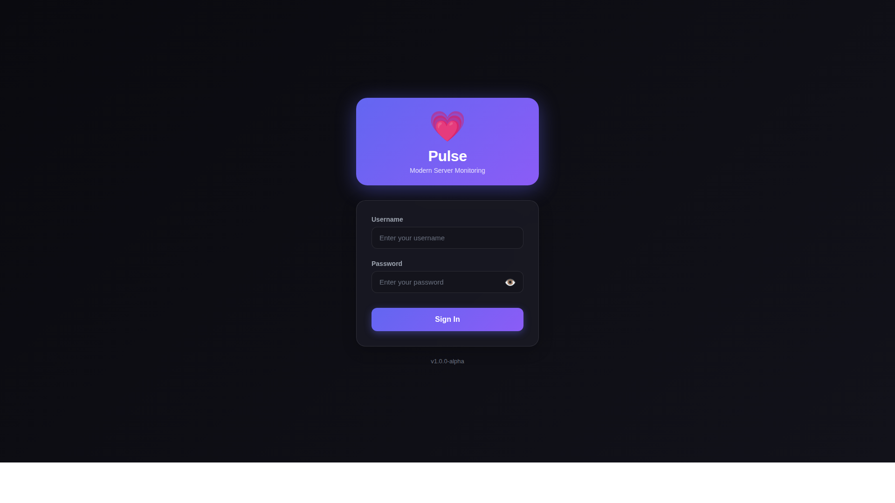
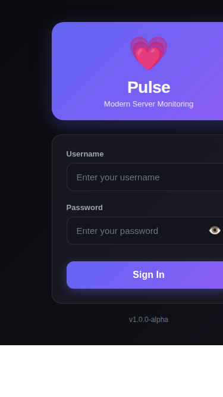
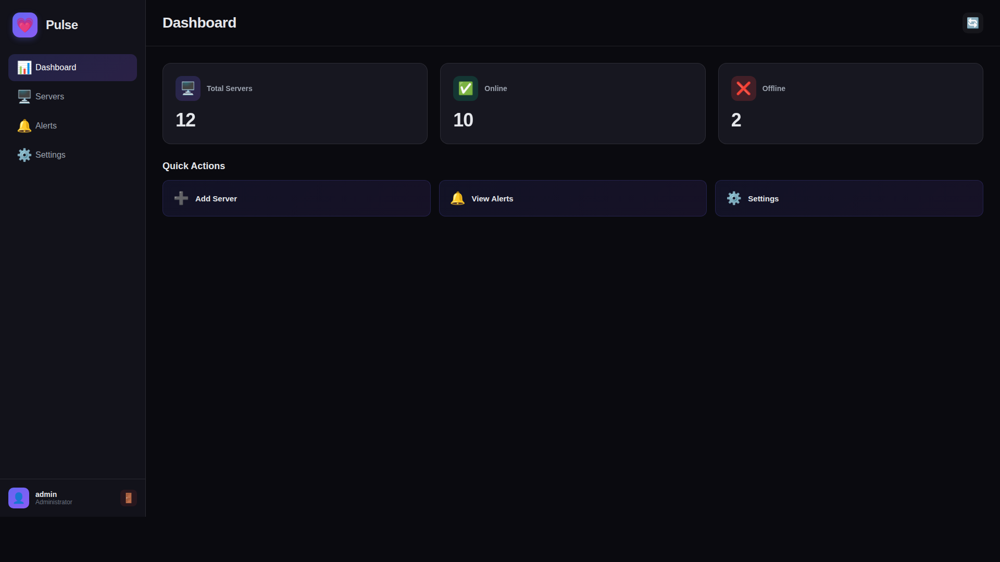
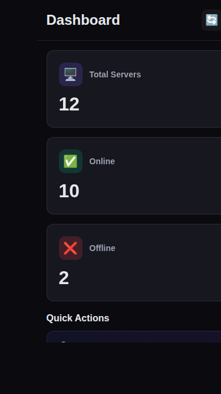
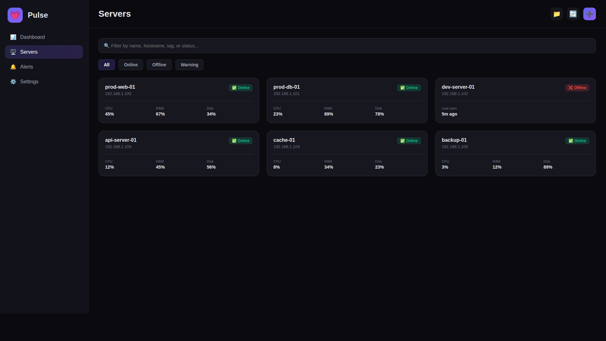

# Screenshots & Visual Documentation

This directory contains visual documentation for the Pulse Server Monitoring app's mobile and desktop views.

## Files

- **VISUAL_DOCUMENTATION.md** - Comprehensive ASCII art diagrams showing all pages in mobile and desktop views
- **mockup.html** - Interactive HTML mockup demonstrating the responsive design
- **PNG Screenshots** - Actual visual representations of the redesigned UI

## Screenshots

### Login Page

**Desktop (1920x1080)**


**Mobile (375x667)**


### Dashboard

**Desktop (1920x1080)**


**Mobile (375x667)**


### Servers List

**Desktop (1920x1080)**


## Viewing the Interactive Mockup

To view the interactive mockup:

1. Open `mockup.html` in any web browser
2. You'll see both mobile (375x667) and desktop (1200x700) views side-by-side
3. The mockup demonstrates:
   - Mobile bottom navigation
   - Desktop left navigation rail
   - Responsive card layouts
   - Touch-friendly spacing
   - Material 3 design system

## App Screenshots

To capture actual screenshots of the running app:

### Option 1: Using Docker
```bash
# From the repository root
docker compose up -d

# Access the app
# Desktop: Open http://localhost:32200 in browser
# Mobile: Open DevTools (F12), enable device toolbar (Ctrl+Shift+M), select a mobile device
```

### Option 2: Using Flutter Directly
```bash
cd app
flutter pub get
flutter run -d chrome --web-port=8080
```

### Taking Screenshots

**Desktop View (1920x1080)**
1. Open app in browser
2. Resize to 1920x1080 or use DevTools device toolbar
3. Navigate through pages: Dashboard, Servers, Alerts, Settings
4. Take screenshots (Print Screen or browser screenshot tool)

**Mobile View (375x667)**
1. Open Chrome DevTools (F12)
2. Enable device toolbar (Ctrl+Shift+M)
3. Select "iPhone SE" (375x667)
4. Navigate through all pages
5. Take screenshots using Chrome's screenshot feature:
   - Open command menu (Ctrl+Shift+P)
   - Type "screenshot"
   - Select "Capture screenshot"

## Pages to Screenshot

### 1. Login Page
- **Desktop**: Centered login form with gradient background
- **Mobile**: Full-width form, optimized for portrait

### 2. Dashboard
- **Desktop**: 3-column status cards, horizontal quick actions
- **Mobile**: Stacked cards, vertical quick actions

### 3. Server List
- **Desktop**: Grid view with filters
- **Mobile**: List view with stacked filters

### 4. Server Detail
- **Desktop**: Side-by-side metrics and containers
- **Mobile**: Stacked panels

### 5. Alerts
- **Desktop**: Table view with tabs
- **Mobile**: Card view with tabs

### 6. Settings
- **Desktop**: List layout with generous spacing
- **Mobile**: Compact list with touch-friendly targets

## Naming Convention

Suggested naming for actual screenshots:
- `01-login-desktop.png`
- `01-login-mobile.png`
- `02-dashboard-desktop.png`
- `02-dashboard-mobile.png`
- `03-servers-list-desktop.png`
- `03-servers-list-mobile.png`
- `04-server-detail-desktop.png`
- `04-server-detail-mobile.png`
- `05-alerts-desktop.png`
- `05-alerts-mobile.png`
- `06-settings-desktop.png`
- `06-settings-mobile.png`

## Mobile Support Features Demonstrated

The screenshots should clearly show:

1. **Navigation**
   - Bottom nav on mobile
   - Side rail on desktop
   
2. **Responsive Layouts**
   - Stacked vs. grid layouts
   - Touch-friendly spacing
   
3. **Logout Button**
   - In app bars on mobile
   - In nav rail on desktop
   
4. **Material 3 Design**
   - Consistent colors
   - Smooth animations
   - Modern UI components

## Note on Mockup

The `mockup.html` file provides a visual representation of the app's layout and responsive behavior. While it uses simplified styling and emoji icons, it accurately demonstrates:

- The navigation structure
- Card layouts
- Responsive breakpoints
- Spacing and padding
- Component arrangement

The actual Flutter app will have:
- Real data from servers
- Live metrics and charts
- Full interactivity
- Flutter's Material 3 components
- Smooth animations and transitions
